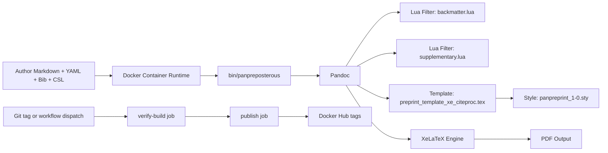

# Panpreposterous Workspace Architecture Anchor

## Metadata

- analysis_timestamp_utc: 2026-06-10T23:59:00Z
- repository_root: /Users/carlocostantini/Dropbox/Macros, Scripts, Templates, Styles/LaTeX/panpreposterous
- analysis_depth: deep
- reproducibility_focus: true
- deterministic_output: true
- anchor_version: 3
- supersedes: anchor_version 2 (2026-06-10)

## Workspace Inventory

Top-level folders currently present:

- .git
- .github
- bin
- docs
- examples
- filters
- scripts
- template
- tests
- tmp

Top-level files currently present:

- .DS_Store
- .gitignore
- Dockerfile
- LICENSE
- NOTICE
- README.md
- panpreposterous.code-workspace

Execution-relevant files:

- Entrypoint wrapper: bin/panpreposterous [E-003]
- Container build and pinned TinyTeX provenance: Dockerfile [E-002]
- XeLaTeX Pandoc template: template/preprint_template_xe_citeproc.tex [E-005]
- Style package: template/panpreprint_1-0.sty [E-006]
- Lua filter (backmatter/tables): filters/backmatter.lua [E-004]
- Lua filter (supplementary append): filters/supplementary.lua [E-007]
- Usage contract: README.md [E-001]
- Complete bundled example manuscript and assets: examples/manuscript.md plus examples/figs and examples/tables [E-008] [E-014]
- Release pipeline automation with verify gate: .github/workflows/publish-image.yml [E-011]
- Image lineage and non-rigid smoke policy docs: docs/release/container-image-lineage.md and docs/release/legacy-image-baseline.json [E-012] [E-013]

## Architecture Map

System overview:



Layered model:

- Runtime and packaging layer: Docker image defines toolchain and runtime filesystem layout [E-002].
- Orchestration layer: shell entrypoint normalizes output path and invokes Pandoc with fixed template, filters, and XeLaTeX engine [E-003].
- Transformation layer: Lua filters implement backmatter behavior, table policy, and deferred supplementary assembly [E-004] [E-007].
- Presentation layer: Pandoc template and style package enforce publication formatting, references balancing, running headers, and DOI rendering [E-005] [E-006].
- Release automation layer: verify-build job gates publication by requiring build + help + example render success before push [E-011].
- Release governance layer: lineage docs encode legacy baseline policy, provenance policy, and non-rigid smoke policy [E-012] [E-013].

## Component Responsibilities

- F-001: README.md defines the public contract as a reproducible container-first conversion pipeline from Markdown assets to PDF [E-001].
- F-002: Dockerfile provisions Debian, Pandoc, TinyTeX, required TeX collections, runtime paths, and copied workspace assets under /opt/panpreposterous [E-002].
- F-003: bin/panpreposterous performs argument pass-through with explicit default output handling and fixed Pandoc option set [E-003].
- F-004: backmatter.lua enforces two-column table policy and supports Div contracts backmatter, onecol, wide, and texinclude [E-004].
- F-005: supplementary.lua captures supplementary Div blocks and emits deferred supplementary material at document end, with generated lists and page-break control [E-007].
- F-006: preprint_template_xe_citeproc.tex composes XeLaTeX behavior, CSL references balancing, side DOI rendering, first-page footer, running headers, and supplementary environment semantics [E-005].
- F-007: panpreprint_1-0.sty centralizes geometry, typography, spacing, float behavior, and title-page style conventions [E-006].
- F-008: examples/manuscript.md demonstrates references, backmatter, supplementary, and texinclude against bundled in-repo assets [E-008] [E-014].
- F-009: .github/copilot-instructions.md keeps reproducibility and explicitness as repository operating constraints [E-009].
- F-010: publish-image.yml defines gated image publication lifecycle and tag strategy [E-011].
- F-011: release lineage docs capture historical baseline, provenance policy, and smoke-test policy boundaries [E-012] [E-013].

## Build and Runtime Paths

Primary path P-001 (render path):

1. Build image with Dockerfile [E-001] [E-002].
2. Run container with manuscript directory mounted at /work [E-001].
3. Execute panpreposterous wrapper command [E-001] [E-003].
4. Wrapper invokes Pandoc with template, backmatter filter, supplementary filter, XeLaTeX, and citeproc [E-003].
5. Pandoc and XeLaTeX produce target PDF artifact [E-001] [E-003].

Release path P-002 (container publication):

1. Push a version tag matching v* or run manual workflow dispatch [E-011].
2. verify-build job builds image and validates wrapper + smoke render [E-011].
3. publish job executes only if verify-build succeeds [E-011].
4. Buildx pushes version and optional latest tags to Docker Hub [E-011].

## Achieved Since Anchor v2

- ACH-005: TinyTeX install flow moved from remote installer piping to pinned release artifact + SHA256 verification in Dockerfile [E-002].
- ACH-006: CI gate now validates full smoke path (build, help command, bundled example render, non-empty PDF artifact) before publish [E-011].
- ACH-007: Non-rigid smoke-test policy is now explicitly documented, avoiding strict PDF hash/byte-size pinning for acceptable template evolution [E-012].

## Gaps and Risks (Current)

- R-002 (important): Runtime still depends on absolute in-container paths across Dockerfile and wrapper script; drift can still cause hard failures [E-002] [E-003].
- R-003 (important): Release governance docs still contain state tension: lineage markdown reports Phase 2 completed while baseline JSON note still says "until Phase 2 comparison is complete" [E-012] [E-013].
- R-004 (important): Wrapper help continues to rely on heredoc emission; valid in runtime shell, but can be sensitive in stricter shell-policy environments [E-003].
- R-006 (suggestion): scripts/, tests/lineage-fixture/, and tmp/lineage-check/ remain structurally present but unpopulated with tracked automation assets.

Resolved since v2:

- R-001 resolved: TinyTeX provenance now pinned and checksum-verified in Dockerfile [E-002].
- R-005 resolved: repository automation now validates render path through smoke test before publish [E-011].

## TODO Roadmap (Updated Status)

- T-001 (critical): Add installer integrity verification in Dockerfile and document provenance policy. Status: achieved [E-002] [E-012].
- T-002 (important): Introduce startup checks in wrapper for template/filter presence and readable input file. Status: open.
- T-003 (important): Create minimal smoke-test example with bundled assets and expected output checksum strategy. Status: achieved with non-rigid policy exception (assets + smoke render present; strict checksum intentionally not required) [E-011] [E-012] [E-014].
- T-004 (important): Add CI task for image build and panpreposterous --help verification. Status: achieved [E-011].
- T-005 (suggestion): Add CI task for rendering smoke example and validating generated PDF presence. Status: achieved [E-011].
- T-006 (suggestion): Document unsupported/unknown runtime assumptions (fonts, external binaries, host volume permissions). Status: open.
- T-007 (important): Create docs/architecture.md summarizing subsystem boundaries and execution flow. Status: open.
- T-008 (important): Create docs/inputs.md describing required and optional manuscript metadata keys. Status: open.
- T-009 (suggestion): Create docs/filters.md for Div classes and table-policy behavior. Status: open.
- T-010 (suggestion): Create docs/troubleshooting.md for common render failures and remediation steps. Status: partially achieved via expanded README and docs/how-to coverage [E-001].

## Natural Next Step

- NEXT-001 (important): Reconcile release-state semantics between docs/release/container-image-lineage.md and docs/release/legacy-image-baseline.json so both sources state the same Phase 2 completion posture.
  - why now: this is the highest-impact remaining governance inconsistency after hardening and CI gate completion.
  - expected impact: remove operator ambiguity during release decisions and onboarding.
  - implementation sketch:
    1. Update legacy-image-baseline.json notes and/or status fields to explicitly acknowledge Phase 2 completion.
    2. Add a small "last_verified_phase" field in JSON for machine-readable automation.
    3. Add a one-line cross-reference in container-image-lineage.md stating JSON is the machine source of truth for phase state.

## Validation Commands

1. Build container image:

```bash
docker build -t panpreposterous -f Dockerfile .
```

1. Verify wrapper help inside container:

```bash
docker run --rm panpreposterous panpreposterous --help
```

1. Verify publish workflow gate by local smoke command equivalent:

```bash
smoke_dir="$(mktemp -d)" && \
cp examples/manuscript.md "$smoke_dir"/ && \
cp examples/references.bib "$smoke_dir"/ && \
cp examples/journal.csl "$smoke_dir"/ && \
cp -R examples/figs "$smoke_dir"/ && \
cp -R examples/tables "$smoke_dir"/ && \
docker run --rm -v "$smoke_dir":/work panpreposterous \
  panpreposterous manuscript.md --bibliography references.bib --csl journal.csl -o smoke-render.pdf && \
test -s "$smoke_dir/smoke-render.pdf"
```

## Evidence Index

- E-001: [README.md#L1](README.md#L1), [README.md#L58](README.md#L58), [README.md#L78](README.md#L78), [README.md#L110](README.md#L110), [README.md#L137](README.md#L137), [README.md#L164](README.md#L164), [README.md#L222](README.md#L222).
- E-002: [Dockerfile#L15](Dockerfile#L15), [Dockerfile#L16](Dockerfile#L16), [Dockerfile#L17](Dockerfile#L17), [Dockerfile#L24](Dockerfile#L24), [Dockerfile#L26](Dockerfile#L26), [Dockerfile#L28](Dockerfile#L28), [Dockerfile#L35](Dockerfile#L35), [Dockerfile#L44](Dockerfile#L44), [Dockerfile#L50](Dockerfile#L50).
- E-003: [bin/panpreposterous#L2](bin/panpreposterous#L2), [bin/panpreposterous#L4](bin/panpreposterous#L4), [bin/panpreposterous#L5](bin/panpreposterous#L5), [bin/panpreposterous#L23](bin/panpreposterous#L23), [bin/panpreposterous#L33](bin/panpreposterous#L33).
- E-004: [filters/backmatter.lua#L2](filters/backmatter.lua#L2), [filters/backmatter.lua#L38](filters/backmatter.lua#L38), [filters/backmatter.lua#L51](filters/backmatter.lua#L51), [filters/backmatter.lua#L90](filters/backmatter.lua#L90), [filters/backmatter.lua#L103](filters/backmatter.lua#L103).
- E-005: [template/preprint_template_xe_citeproc.tex#L4](template/preprint_template_xe_citeproc.tex#L4), [template/preprint_template_xe_citeproc.tex#L68](template/preprint_template_xe_citeproc.tex#L68), [template/preprint_template_xe_citeproc.tex#L95](template/preprint_template_xe_citeproc.tex#L95), [template/preprint_template_xe_citeproc.tex#L209](template/preprint_template_xe_citeproc.tex#L209).
- E-006: [template/panpreprint_1-0.sty#L1](template/panpreprint_1-0.sty#L1), [template/panpreprint_1-0.sty#L33](template/panpreprint_1-0.sty#L33), [template/panpreprint_1-0.sty#L87](template/panpreprint_1-0.sty#L87), [template/panpreprint_1-0.sty#L169](template/panpreprint_1-0.sty#L169).
- E-007: [filters/supplementary.lua#L1](filters/supplementary.lua#L1), [filters/supplementary.lua#L32](filters/supplementary.lua#L32), [filters/supplementary.lua#L65](filters/supplementary.lua#L65), [filters/supplementary.lua#L122](filters/supplementary.lua#L122), [filters/supplementary.lua#L173](filters/supplementary.lua#L173).
- E-008: [examples/manuscript.md#L2](examples/manuscript.md#L2), [examples/manuscript.md#L24](examples/manuscript.md#L24), [examples/manuscript.md#L36](examples/manuscript.md#L36), [examples/manuscript.md#L65](examples/manuscript.md#L65), [examples/manuscript.md#L70](examples/manuscript.md#L70).
- E-009: [.github/copilot-instructions.md#L5](.github/copilot-instructions.md#L5), [.github/copilot-instructions.md#L6](.github/copilot-instructions.md#L6), [.github/copilot-instructions.md#L9](.github/copilot-instructions.md#L9), [.github/copilot-instructions.md#L36](.github/copilot-instructions.md#L36).
- E-010: [panpreposterous.code-workspace#L2](panpreposterous.code-workspace#L2), [panpreposterous.code-workspace#L7](panpreposterous.code-workspace#L7), [panpreposterous.code-workspace#L10](panpreposterous.code-workspace#L10), [panpreposterous.code-workspace#L13](panpreposterous.code-workspace#L13).
- E-011: [.github/workflows/publish-image.yml#L26](.github/workflows/publish-image.yml#L26), [.github/workflows/publish-image.yml#L32](.github/workflows/publish-image.yml#L32), [.github/workflows/publish-image.yml#L38](.github/workflows/publish-image.yml#L38), [.github/workflows/publish-image.yml#L44](.github/workflows/publish-image.yml#L44), [.github/workflows/publish-image.yml#L54](.github/workflows/publish-image.yml#L54), [.github/workflows/publish-image.yml#L56](.github/workflows/publish-image.yml#L56), [.github/workflows/publish-image.yml#L59](.github/workflows/publish-image.yml#L59), [.github/workflows/publish-image.yml#L115](.github/workflows/publish-image.yml#L115).
- E-012: [docs/release/container-image-lineage.md#L59](docs/release/container-image-lineage.md#L59), [docs/release/container-image-lineage.md#L77](docs/release/container-image-lineage.md#L77), [docs/release/container-image-lineage.md#L86](docs/release/container-image-lineage.md#L86), [docs/release/container-image-lineage.md#L97](docs/release/container-image-lineage.md#L97), [docs/release/container-image-lineage.md#L109](docs/release/container-image-lineage.md#L109).
- E-013: [docs/release/legacy-image-baseline.json#L7](docs/release/legacy-image-baseline.json#L7), [docs/release/legacy-image-baseline.json#L13](docs/release/legacy-image-baseline.json#L13), [docs/release/legacy-image-baseline.json#L15](docs/release/legacy-image-baseline.json#L15).
- E-014: [examples/README.md#L1](examples/README.md#L1), [examples/README.md#L6](examples/README.md#L6), [examples/README.md#L12](examples/README.md#L12), [examples/README.md#L26](examples/README.md#L26), [examples/README.md#L33](examples/README.md#L33).

## Machine Summary JSON

```json
{
  "anchor": {
    "name": "Panpreposterous Workspace Architecture Anchor",
    "analysis_timestamp_utc": "2026-06-10T23:59:00Z",
    "analysis_depth": "deep",
    "reproducibility_focus": true,
    "deterministic_output": true,
    "anchor_version": 3
  },
  "achieved_since_v2": {
    "count": 3,
    "ids": [
      "ACH-005",
      "ACH-006",
      "ACH-007"
    ]
  },
  "risks": {
    "count": 4,
    "important": [
      "R-002",
      "R-003",
      "R-004"
    ],
    "suggestion": [
      "R-006"
    ],
    "resolved_since_v2": [
      "R-001",
      "R-005"
    ]
  },
  "todo": {
    "achieved": [
      "T-001",
      "T-003",
      "T-004",
      "T-005"
    ],
    "open": [
      "T-002",
      "T-006",
      "T-007",
      "T-008",
      "T-009"
    ],
    "partial": [
      "T-010"
    ]
  },
  "next_step": "NEXT-001",
  "evidence": {
    "count": 14,
    "ids": [
      "E-001",
      "E-002",
      "E-003",
      "E-004",
      "E-005",
      "E-006",
      "E-007",
      "E-008",
      "E-009",
      "E-010",
      "E-011",
      "E-012",
      "E-013",
      "E-014"
    ]
  }
}
```
