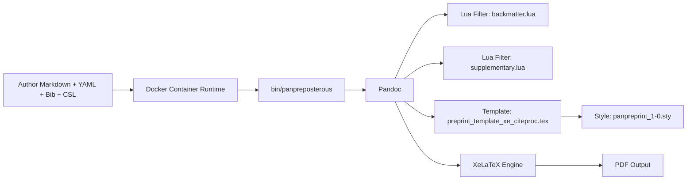
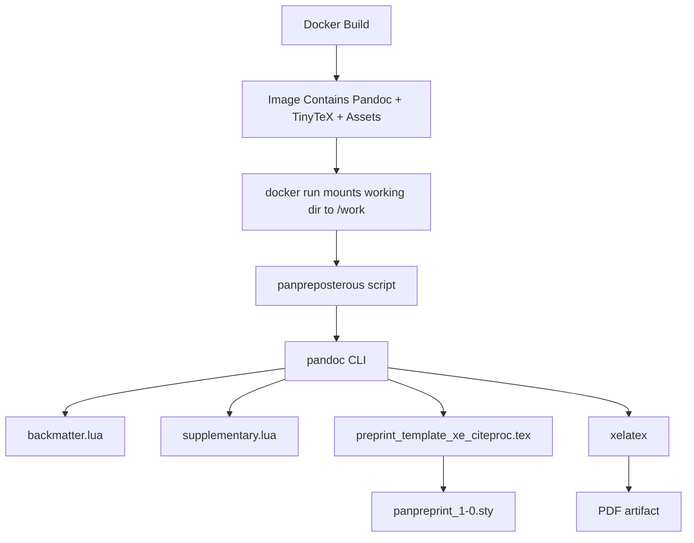

# Title

Panpreposterous Workspace Architecture Anchor

## Metadata

- analysis_timestamp_utc: 2026-06-06T03:53:03Z
- repository_root: /Users/carlocostantini/Dropbox/Macros, Scripts, Templates, Styles/LaTeX/panpreposterous
- analysis_depth: deep
- reproducibility_focus: true
- deterministic_output: true
- anchor_version: 1

## Workspace Inventory

Top-level folders:

- .git
- .github
- bin
- docs
- examples
- filters
- template

Top-level files:

- .DS_Store
- Dockerfile
- README.md
- panpreposterous.code-workspace

Execution-relevant files:

- Entrypoint wrapper: bin/panpreposterous [E-003]
- Container build: Dockerfile [E-002]
- XeLaTeX Pandoc template: template/preprint_template_xe_citeproc.tex [E-005]
- Style package: template/panpreprint_1-0.sty [E-006]
- Lua filter (backmatter/tables): filters/backmatter.lua [E-004]
- Lua filter (supplementary append): filters/supplementary.lua [E-007]
- Usage contract: README.md [E-001]
- Reference example manuscript: examples/manuscript.md [E-008]

## Architecture Map

System overview:



Layered model:

- Runtime and packaging layer: Docker image defines toolchain and runtime filesystem layout [E-002].
- Orchestration layer: shell entrypoint normalizes output path and invokes Pandoc with fixed template, filters, and XeLaTeX engine [E-003].
- Transformation layer: Lua filters implement backmatter behavior, table policy, and deferred supplementary assembly [E-004] [E-007].
- Presentation layer: Pandoc template and style package enforce publication formatting, references behavior, and metadata-driven switches [E-005] [E-006].

## Component Responsibilities

- F-001: README.md defines the public contract as a reproducible container-first conversion pipeline from Markdown and bibliographic assets to PDF [E-001].
- F-002: Dockerfile provisions Debian, Pandoc, TinyTeX, TeX collections, runtime paths, and copied workspace assets under /opt/panpreposterous [E-002].
- F-003: bin/panpreposterous performs argument pass-through with explicit default output handling and fixed Pandoc option set [E-003].
- F-004: backmatter.lua enforces two-column table policy and supports structural Div contracts such as backmatter, onecol, wide, and texinclude [E-004].
- F-005: supplementary.lua captures supplementary Div blocks and emits deferred supplementary material at document end with generated figure/table lists and page breaks [E-007].
- F-006: preprint_template_xe_citeproc.tex composes XeLaTeX document behavior, CSL formatting, side DOI rendering, running header customization, and supplementary environment semantics [E-005].
- F-007: panpreprint_1-0.sty centralizes geometry, typography, float/section spacing, header behavior, and title-page styling conventions [E-006].
- F-008: examples/manuscript.md documents intended metadata schema and content conventions for twocolumn output, references block, backmatter, and supplementary block usage [E-008].
- F-009: .github/copilot-instructions.md enforces reproducibility and explicitness as repository-level operating constraints [E-009].

## Dependency Flow

Execution-order dependency graph:



Dependency details:

- Pandoc is installed in the image and is a hard runtime dependency [E-002].
- XeLaTeX availability is guaranteed by TinyTeX and collection-xetex installation [E-002].
- Template resolution depends on TEXINPUTS including /opt/panpreposterous/template [E-002].
- Wrapper script binds both Lua filters and the template at fixed absolute paths [E-003].
- Supplementary ordering behavior depends on interaction between template supplementary environment and deferred filter insertion via AtEndDocument [E-005] [E-007].

Coupling and critical path:

- Critical coupling: wrapper-script path constants to /opt/panpreposterous filesystem layout in image [E-002] [E-003].
- Critical coupling: twocolumn metadata toggles both table suppression policy and references balancing behavior [E-004] [E-005].
- Critical coupling: supplementary behavior requires Div class supplementary in manuscript source [E-007] [E-008].

## Build and Runtime Paths

Primary path P-001 (documented happy path):

1. Build image with Dockerfile [E-001] [E-002].
2. Run container with manuscript directory mounted at /work [E-001].
3. Execute panpreposterous wrapper command [E-001] [E-003].
4. Wrapper invokes Pandoc with template, backmatter filter, supplementary filter, XeLaTeX, and citeproc [E-003].
5. Pandoc and XeLaTeX produce target PDF artifact [E-001] [E-003].

Alternate path P-002 (help/inspection path):

1. Execute panpreposterous --help without manuscript conversion [E-003].
2. Verify template/filter defaults and usage syntax [E-003].

Branch path P-003 (two-column table handling):

1. twocolumn: true in manuscript metadata enables strict table policy defaults [E-004] [E-008].
2. Markdown tables are suppressed unless allowmd, or forced through one-column island for selected table classes [E-004].

Branch path P-004 (supplementary deferral):

1. Manuscript supplementary Div is collected and removed from immediate flow [E-007] [E-008].
2. Supplementary block is appended at end via LaTeX AtEndDocument with generated supplementary figure/table lists [E-007].

Failure branches:

- Missing container runtime prevents all standard execution paths (no non-container fallback documented) [E-001].
- Missing input assets in mounted manuscript folder (for example figures or bibliography) can break successful render [E-001] [E-008].

## Gaps and Risks

- R-001 (critical): Remote installer execution in Dockerfile fetches and executes TinyTeX install script directly over network, creating supply-chain integrity exposure [E-002].
- R-002 (important): Runtime depends on absolute in-container path conventions between Dockerfile copy targets and wrapper defaults; drift causes hard failures [E-002] [E-003].
- R-003 (important): Example manuscript references figure paths and citation usage but repository example folder does not include referenced assets, reducing executable reproducibility of examples [E-008].
- R-004 (important): Wrapper help uses heredoc emission; behavior is valid in script runtime but can complicate strict shell policy environments or static quality tooling [E-003].
- R-005 (suggestion): Public usage docs are concise but do not provide a deterministic end-to-end smoke test that is guaranteed to pass in-repo without external assets [E-001] [E-008].

Gap summary:

- Documentation gap: no anchor architecture doc previously present before this analysis run [E-010].
- Validation gap: no explicit CI or scripted verification target for build and render path correctness [E-001] [E-002].

## Refactor Proposals

- F-REF-001: Pin and verify TinyTeX installer provenance (for example checksum verification or fixed release artifact retrieval) before execution.
  - expected_impact: reduce supply-chain risk and improve reproducibility confidence.
  - evidence: [E-002].
- F-REF-002: Centralize path constants in one source (script or environment variables) and assert existence at startup.
  - expected_impact: reduce configuration drift between image layout and wrapper assumptions.
  - evidence: [E-002] [E-003].
- F-REF-003: Add a minimal in-repo smoke manuscript and assets dedicated to automated validation.
  - expected_impact: enable deterministic and repeatable rendering checks.
  - evidence: [E-001] [E-008].
- F-REF-004: Add machine-readable manifest documenting required manuscript-side inputs (bib, csl, figures) and optional metadata keys.
  - expected_impact: improve downstream automation reliability for document generation workflows.
  - evidence: [E-001] [E-005] [E-008].

## TODO Roadmap

Priority order:

- T-001 (critical): Add installer integrity verification in Dockerfile and document provenance policy.
- T-002 (important): Introduce startup checks in wrapper for template/filter presence and readable input file.
- T-003 (important): Create minimal smoke-test example with bundled assets and expected output checksum strategy.
- T-004 (important): Add CI task for image build and panpreposterous --help command verification.
- T-005 (suggestion): Add CI task for rendering smoke example and validating generated PDF presence.
- T-006 (suggestion): Document unsupported/unknown runtime assumptions (fonts, external binaries, host volume permissions).

Documentation backlog:

- T-007 (important): Create docs/architecture.md summarizing subsystem boundaries and execution flow.
- T-008 (important): Create docs/inputs.md describing required and optional manuscript metadata keys.
- T-009 (suggestion): Create docs/filters.md for Div classes and table-policy behavior.
- T-010 (suggestion): Create docs/troubleshooting.md for common render failures and remediation steps.

## Unknowns and Assumptions

Unknowns:

- U-001: No repository-native CI workflow file was observed in analyzed workspace listing, so automated validation policy is unknown [E-010].
- U-002: Expected supported host architectures are partially implied by PATH entries but not explicitly documented in README [E-002] [E-001].
- U-003: Availability requirements for manuscript-side assets (figures, bib, csl) are implied but not formally schema-validated in wrapper logic [E-001] [E-003] [E-008].

Assumptions:

- A-001: Docker is the canonical execution environment for end users [E-001].
- A-002: Pandoc + XeLaTeX toolchain versions from container build are considered authoritative for reproducibility [E-002].
- A-003: Supplementary section should always be emitted at document end after bibliography lifecycle [E-005] [E-007].

## Validation Commands

1. Build container image:

```bash
docker build -t panpreposterous -f Dockerfile .
```

1. Verify wrapper help inside container:

```bash
docker run --rm panpreposterous panpreposterous --help
```

1. Verify shell syntax of wrapper script:

```bash
bash -n bin/panpreposterous
```

1. Verify template and filters are present in image:

```bash
docker run --rm panpreposterous ls -la /opt/panpreposterous/template /opt/panpreposterous/filters
```

1. Verify XeLaTeX availability in image:

```bash
docker run --rm panpreposterous xelatex --version
```

## Evidence Index

- E-001: [README.md#L1](README.md#L1), [README.md#L3](README.md#L3), [README.md#L6](README.md#L6), [README.md#L9](README.md#L9), [README.md#L12](README.md#L12), [README.md#L17](README.md#L17), [README.md#L21](README.md#L21), [README.md#L30](README.md#L30), [README.md#L44](README.md#L44).
- E-002: [Dockerfile#L4](Dockerfile#L4), [Dockerfile#L9](Dockerfile#L9), [Dockerfile#L15](Dockerfile#L15), [Dockerfile#L19](Dockerfile#L19), [Dockerfile#L22](Dockerfile#L22), [Dockerfile#L30](Dockerfile#L30), [Dockerfile#L31](Dockerfile#L31), [Dockerfile#L32](Dockerfile#L32), [Dockerfile#L33](Dockerfile#L33), [Dockerfile#L37](Dockerfile#L37), [Dockerfile#L39](Dockerfile#L39).
- E-003: [bin/panpreposterous#L2](bin/panpreposterous#L2), [bin/panpreposterous#L4](bin/panpreposterous#L4), [bin/panpreposterous#L12](bin/panpreposterous#L12), [bin/panpreposterous#L23](bin/panpreposterous#L23), [bin/panpreposterous#L33](bin/panpreposterous#L33), [bin/panpreposterous#L34](bin/panpreposterous#L34), [bin/panpreposterous#L35](bin/panpreposterous#L35), [bin/panpreposterous#L36](bin/panpreposterous#L36), [bin/panpreposterous#L37](bin/panpreposterous#L37), [bin/panpreposterous#L38](bin/panpreposterous#L38).
- E-004: [filters/backmatter.lua#L2](filters/backmatter.lua#L2), [filters/backmatter.lua#L38](filters/backmatter.lua#L38), [filters/backmatter.lua#L51](filters/backmatter.lua#L51), [filters/backmatter.lua#L66](filters/backmatter.lua#L66), [filters/backmatter.lua#L72](filters/backmatter.lua#L72), [filters/backmatter.lua#L81](filters/backmatter.lua#L81), [filters/backmatter.lua#L90](filters/backmatter.lua#L90), [filters/backmatter.lua#L95](filters/backmatter.lua#L95), [filters/backmatter.lua#L103](filters/backmatter.lua#L103).
- E-005: [template/preprint_template_xe_citeproc.tex#L4](template/preprint_template_xe_citeproc.tex#L4), [template/preprint_template_xe_citeproc.tex#L68](template/preprint_template_xe_citeproc.tex#L68), [template/preprint_template_xe_citeproc.tex#L95](template/preprint_template_xe_citeproc.tex#L95), [template/preprint_template_xe_citeproc.tex#L102](template/preprint_template_xe_citeproc.tex#L102), [template/preprint_template_xe_citeproc.tex#L120](template/preprint_template_xe_citeproc.tex#L120), [template/preprint_template_xe_citeproc.tex#L170](template/preprint_template_xe_citeproc.tex#L170), [template/preprint_template_xe_citeproc.tex#L209](template/preprint_template_xe_citeproc.tex#L209), [template/preprint_template_xe_citeproc.tex#L251](template/preprint_template_xe_citeproc.tex#L251), [template/preprint_template_xe_citeproc.tex#L329](template/preprint_template_xe_citeproc.tex#L329).
- E-006: [template/panpreprint_1-0.sty#L1](template/panpreprint_1-0.sty#L1), [template/panpreprint_1-0.sty#L33](template/panpreprint_1-0.sty#L33), [template/panpreprint_1-0.sty#L45](template/panpreprint_1-0.sty#L45), [template/panpreprint_1-0.sty#L67](template/panpreprint_1-0.sty#L67), [template/panpreprint_1-0.sty#L87](template/panpreprint_1-0.sty#L87), [template/panpreprint_1-0.sty#L128](template/panpreprint_1-0.sty#L128), [template/panpreprint_1-0.sty#L169](template/panpreprint_1-0.sty#L169), [template/panpreprint_1-0.sty#L181](template/panpreprint_1-0.sty#L181), [template/panpreprint_1-0.sty#L194](template/panpreprint_1-0.sty#L194).
- E-007: [filters/supplementary.lua#L1](filters/supplementary.lua#L1), [filters/supplementary.lua#L32](filters/supplementary.lua#L32), [filters/supplementary.lua#L65](filters/supplementary.lua#L65), [filters/supplementary.lua#L105](filters/supplementary.lua#L105), [filters/supplementary.lua#L122](filters/supplementary.lua#L122), [filters/supplementary.lua#L127](filters/supplementary.lua#L127), [filters/supplementary.lua#L143](filters/supplementary.lua#L143), [filters/supplementary.lua#L166](filters/supplementary.lua#L166), [filters/supplementary.lua#L173](filters/supplementary.lua#L173).
- E-008: [examples/manuscript.md#L1](examples/manuscript.md#L1), [examples/manuscript.md#L16](examples/manuscript.md#L16), [examples/manuscript.md#L27](examples/manuscript.md#L27), [examples/manuscript.md#L29](examples/manuscript.md#L29), [examples/manuscript.md#L43](examples/manuscript.md#L43), [examples/manuscript.md#L47](examples/manuscript.md#L47), [examples/manuscript.md#L55](examples/manuscript.md#L55), [examples/manuscript.md#L58](examples/manuscript.md#L58).
- E-009: [.github/copilot-instructions.md#L5](.github/copilot-instructions.md#L5), [.github/copilot-instructions.md#L6](.github/copilot-instructions.md#L6), [.github/copilot-instructions.md#L9](.github/copilot-instructions.md#L9), [.github/copilot-instructions.md#L36](.github/copilot-instructions.md#L36), [.github/copilot-instructions.md#L38](.github/copilot-instructions.md#L38), [.github/copilot-instructions.md#L40](.github/copilot-instructions.md#L40).
- E-010: [panpreposterous.code-workspace#L1](panpreposterous.code-workspace#L1).

## Machine Summary JSON

```json
{
  "anchor": {
    "name": "Panpreposterous Workspace Architecture Anchor",
    "analysis_timestamp_utc": "2026-06-06T03:53:03Z",
    "analysis_depth": "deep",
    "reproducibility_focus": true,
    "deterministic_output": true
  },
  "workspace": {
    "top_level_folders": [
      ".git",
      ".github",
      "bin",
      "docs",
      "examples",
      "filters",
      "template"
    ],
    "top_level_files": [
      ".DS_Store",
      "Dockerfile",
      "README.md",
      "panpreposterous.code-workspace"
    ]
  },
  "findings": {
    "count": 9,
    "ids": [
      "F-001",
      "F-002",
      "F-003",
      "F-004",
      "F-005",
      "F-006",
      "F-007",
      "F-008",
      "F-009"
    ]
  },
  "risks": {
    "count": 5,
    "critical": [
      "R-001"
    ],
    "important": [
      "R-002",
      "R-003",
      "R-004"
    ],
    "suggestion": [
      "R-005"
    ]
  },
  "unknowns": {
    "count": 3,
    "ids": [
      "U-001",
      "U-002",
      "U-003"
    ]
  },
  "todo": {
    "count": 10,
    "ids": [
      "T-001",
      "T-002",
      "T-003",
      "T-004",
      "T-005",
      "T-006",
      "T-007",
      "T-008",
      "T-009",
      "T-010"
    ]
  },
  "validation_commands": {
    "count": 5
  },
  "evidence": {
    "count": 10,
    "ids": [
      "E-001",
      "E-002",
      "E-003",
      "E-004",
      "E-005",
      "E-006",
      "E-007",
      "E-008",
      "E-009",
      "E-010"
    ]
  }
}
```
