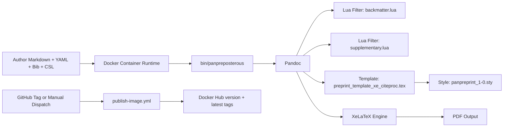
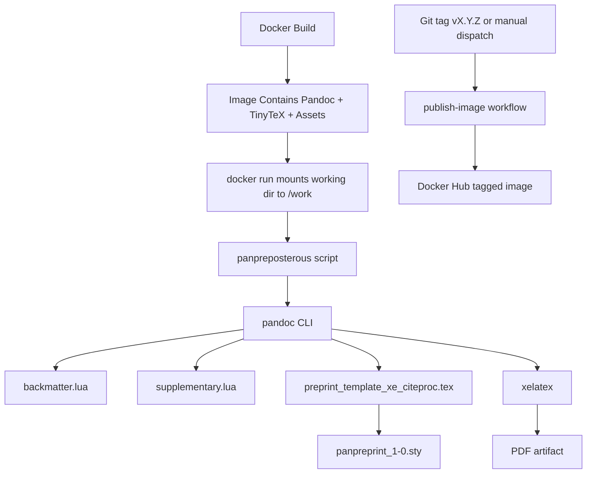

## Panpreposterous Workspace Architecture Anchor

## Metadata

- analysis_timestamp_utc: 2026-06-10T00:00:00Z
- repository_root: /Users/carlocostantini/Dropbox/Macros, Scripts, Templates, Styles/LaTeX/panpreposterous
- analysis_depth: deep
- reproducibility_focus: true
- deterministic_output: true
- anchor_version: 2
- supersedes: anchor_version 1 (2026-06-06)

## Workspace Inventory

Top-level folders currently present:

- .git
- .github
- bin
- docs
- examples
- filters
- scripts
- template
- tests
- tmp

Top-level files currently present:

- .DS_Store
- .gitignore
- Dockerfile
- LICENSE
- NOTICE
- README.md
- panpreposterous.code-workspace

Execution-relevant files:

- Entrypoint wrapper: bin/panpreposterous [E-003]
- Container build: Dockerfile [E-002]
- XeLaTeX Pandoc template: template/preprint_template_xe_citeproc.tex [E-005]
- Style package: template/panpreprint_1-0.sty [E-006]
- Lua filter (backmatter/tables): filters/backmatter.lua [E-004]
- Lua filter (supplementary append): filters/supplementary.lua [E-007]
- Usage contract: README.md [E-001]
- Complete bundled example manuscript and assets: examples/manuscript.md plus examples/figs and examples/tables [E-008] [E-014]
- Release pipeline automation: .github/workflows/publish-image.yml [E-011]
- Image lineage policy docs: docs/release/container-image-lineage.md and docs/release/legacy-image-baseline.json [E-012] [E-013]

## Architecture Map

System overview:



Layered model:

- Runtime and packaging layer: Docker image defines toolchain and runtime filesystem layout [E-002].
- Orchestration layer: shell entrypoint normalizes output path and invokes Pandoc with fixed template, filters, and XeLaTeX engine [E-003].
- Transformation layer: Lua filters implement backmatter behavior, table policy, and deferred supplementary assembly [E-004] [E-007].
- Presentation layer: Pandoc template and style package enforce publication formatting, references balancing, running headers, and DOI rendering [E-005] [E-006].
- Release automation layer: publish workflow performs Docker Hub login, metadata/tag resolution, and image push on `v*` tags or manual dispatch [E-011].
- Release governance layer: lineage docs encode frozen legacy tag policy and versioning constraints [E-012] [E-013].

## Component Responsibilities

- F-001: README.md defines the public contract as a reproducible container-first conversion pipeline from Markdown assets to PDF [E-001].
- F-002: Dockerfile provisions Debian, Pandoc, TinyTeX, required TeX collections, runtime paths, and copied workspace assets under /opt/panpreposterous [E-002].
- F-003: bin/panpreposterous performs argument pass-through with explicit default output handling and fixed Pandoc option set [E-003].
- F-004: backmatter.lua enforces two-column table policy and supports Div contracts `backmatter`, `onecol`, `wide`, and `texinclude` [E-004].
- F-005: supplementary.lua captures `supplementary` Div blocks and emits deferred supplementary material at document end, with generated lists and page-break control [E-007].
- F-006: preprint_template_xe_citeproc.tex composes XeLaTeX behavior, CSL references balancing, side DOI rendering, first-page footer, running headers, and supplementary environment semantics [E-005].
- F-007: panpreprint_1-0.sty centralizes geometry, typography, spacing, float behavior, and title-page style conventions [E-006].
- F-008: examples/manuscript.md now demonstrates references, backmatter, supplementary, and texinclude against bundled in-repo assets [E-008] [E-014].
- F-009: .github/copilot-instructions.md keeps reproducibility and explicitness as repository operating constraints [E-009].
- F-010: publish-image.yml defines image publication lifecycle and tag strategy [E-011].
- F-011: release lineage docs capture historical baseline and publication policy boundaries [E-012] [E-013].

## Dependency Flow

Execution-order dependency graph:



Dependency details:

- Pandoc is installed in the image and is a hard runtime dependency [E-002].
- XeLaTeX availability is guaranteed by TinyTeX and `collection-xetex` installation [E-002].
- Template resolution depends on TEXINPUTS including /opt/panpreposterous/template [E-002].
- Wrapper script binds both Lua filters and the template at fixed absolute paths [E-003].
- Supplementary ordering behavior depends on interaction between template supplementary environment and deferred filter insertion via `\AtEndDocument` [E-005] [E-007].
- Publish automation depends on Docker Hub credentials, Buildx, metadata-action output, and Dockerfile context [E-011].

Coupling and critical path:

- Critical coupling: wrapper-script absolute paths must stay aligned with Dockerfile copy targets [E-002] [E-003].
- Critical coupling: `twocolumn` metadata influences table suppression behavior and reference balancing behavior [E-004] [E-005].
- Critical coupling: supplementary behavior requires Div class `supplementary` in manuscript source [E-007] [E-008].
- Critical coupling: release policy docs define operational constraints for legacy tag handling in parallel to workflow behavior [E-011] [E-012] [E-013].

## Build and Runtime Paths

Primary path P-001 (render path):

1. Build image with Dockerfile [E-001] [E-002].
2. Run container with manuscript directory mounted at /work [E-001].
3. Execute panpreposterous wrapper command [E-001] [E-003].
4. Wrapper invokes Pandoc with template, backmatter filter, supplementary filter, XeLaTeX, and citeproc [E-003].
5. Pandoc and XeLaTeX produce target PDF artifact [E-001] [E-003].

Alternate path P-002 (help/inspection path):

1. Execute panpreposterous --help without manuscript conversion [E-003].
2. Verify template/filter defaults and usage syntax [E-003].

Branch path P-003 (two-column table handling):

1. `twocolumn: true` in metadata enables strict table policy defaults [E-004] [E-008].
2. Markdown tables are suppressed unless `allowmd`, or forced through one-column islands for selected classes [E-004].

Branch path P-004 (supplementary deferral):

1. Manuscript supplementary Div blocks are collected and removed from immediate flow [E-007] [E-008].
2. Supplementary material is appended at document end with generated figure/table lists and float page breaks [E-007].

Release path P-005 (container publication):

1. Push a version tag matching `v*` or run manual workflow dispatch [E-011].
2. Workflow resolves version and optional latest tagging strategy [E-011].
3. Buildx builds from repository Dockerfile and pushes to Docker Hub [E-011].

## Achieved Since Previous Anchor

- ACH-001: Repository-native CI/CD publication workflow exists now (`publish-image.yml`), resolving prior uncertainty about automation presence [E-011].
- ACH-002: Release lineage documentation was added, including machine-readable baseline metadata and publication policy constraints [E-012] [E-013].
- ACH-003: Example reproducibility assets gap is closed at file level: `fig1.svg`, `s1.png`, and `table1.tex` now exist and are referenced by the example manuscript [E-008] [E-014].
- ACH-004: Workspace file paths were updated and reflect active multi-root structure [E-010].

## Gaps and Risks

- R-001 (critical): Dockerfile still executes TinyTeX installer script directly from network without pinned checksum or signature verification [E-002].
- R-002 (important): Runtime still depends on absolute in-container paths across Dockerfile and wrapper script; drift will cause hard failures [E-002] [E-003].
- R-003 (important): Release governance docs contain state tension: lineage doc states Phase 2 completed, while baseline JSON notes still say Phase 2 is pending, creating potential operator ambiguity [E-012] [E-013].
- R-004 (important): Wrapper help continues to rely on heredoc emission; valid in runtime shell, but still sensitive under stricter shell policy/tooling regimes [E-003].
- R-005 (suggestion): No repository automation currently validates full render behavior (image build + example render + output assertions) on every change [E-011] [E-014].
- R-006 (suggestion): `scripts/`, `tests/lineage-fixture/`, and `tmp/lineage-check/` are present in workspace structure but currently unpopulated, leaving intended validation pathways implied rather than executable.

## Refactor Proposals

- F-REF-001: Pin and verify TinyTeX installer provenance before execution (checksum/signature or pinned artifact source).
  - expected_impact: reduce supply-chain exposure and improve deterministic rebuild trust.
  - evidence: [E-002].
- F-REF-002: Introduce startup assertions in wrapper for required template/filter paths and readable manuscript input.
  - expected_impact: fail fast with actionable errors when image layout or input assumptions break.
  - evidence: [E-002] [E-003].
- F-REF-003: Add CI smoke job that builds image, runs `panpreposterous --help`, renders bundled example, and asserts output artifact presence.
  - expected_impact: convert documentation-level reproducibility claims into automated guarantees.
  - evidence: [E-001] [E-011] [E-014].
- F-REF-004: Reconcile Phase 2 status text between release markdown and baseline JSON to a single authoritative state model.
  - expected_impact: eliminate publication-policy ambiguity during release operations.
  - evidence: [E-012] [E-013].

## TODO Roadmap

Completion status updates:

- T-001 (critical): Add installer integrity verification in Dockerfile and document provenance policy. Status: open.
- T-002 (important): Introduce startup checks in wrapper for template/filter presence and readable input file. Status: open.
- T-003 (important): Create minimal smoke-test example with bundled assets and expected output checksum strategy. Status: partially achieved (assets exist, formal checksum strategy not present) [E-008] [E-014].
- T-004 (important): Add CI task for image build and `panpreposterous --help` verification. Status: partially achieved (publish workflow exists, but no explicit render/help validation stage) [E-011].
- T-005 (suggestion): Add CI task for rendering smoke example and validating generated PDF presence. Status: open.
- T-006 (suggestion): Document unsupported/unknown runtime assumptions (fonts, external binaries, host volume permissions). Status: open.
- T-007 (important): Create docs/architecture.md summarizing subsystem boundaries and execution flow. Status: open.
- T-008 (important): Create docs/inputs.md describing required and optional manuscript metadata keys. Status: open.
- T-009 (suggestion): Create docs/filters.md for Div classes and table-policy behavior. Status: open.
- T-010 (suggestion): Create docs/troubleshooting.md for common render failures and remediation steps. Status: partially achieved via expanded README and docs/how-to coverage [E-001].

## Unknowns and Assumptions

Unknowns:

- U-001 resolved: CI workflow is now present and versioned in-repo [E-011].
- U-002: Supported host architecture matrix remains only partially explicit; workflow publishes linux/amd64, but end-user support matrix is not fully specified in user-facing docs [E-001] [E-011].
- U-003: Manuscript-side asset requirements are still convention-driven and not schema-validated by wrapper logic [E-001] [E-003] [E-008].
- U-004: No in-repo evidence yet of continuously enforced render regression baselines across revisions.

Assumptions:

- A-001: Docker is the canonical execution environment for end users [E-001].
- A-002: Containerized Pandoc + XeLaTeX toolchain remains the reproducibility authority [E-002].
- A-003: Supplementary section should be emitted at document end after references lifecycle [E-005] [E-007].

## Validation Commands

1. Build container image:

```bash
docker build -t panpreposterous -f Dockerfile .
```

1. Verify wrapper help inside container:

```bash
docker run --rm panpreposterous panpreposterous --help
```

1. Verify shell syntax of wrapper script:

```bash
bash -n bin/panpreposterous
```

1. Verify template and filters are present in image:

```bash
docker run --rm panpreposterous ls -la /opt/panpreposterous/template /opt/panpreposterous/filters
```

1. Verify XeLaTeX availability in image:

```bash
docker run --rm panpreposterous xelatex --version
```

1. Verify publish workflow existence and trigger config:

```bash
grep -n 'name:\|workflow_dispatch:\|tags:' .github/workflows/publish-image.yml
```

## Evidence Index

- E-001: [README.md#L1](README.md#L1), [README.md#L3](README.md#L3), [README.md#L58](README.md#L58), [README.md#L78](README.md#L78), [README.md#L110](README.md#L110), [README.md#L127](README.md#L127), [README.md#L137](README.md#L137), [README.md#L164](README.md#L164), [README.md#L222](README.md#L222).
- E-002: [Dockerfile#L4](Dockerfile#L4), [Dockerfile#L15](Dockerfile#L15), [Dockerfile#L21](Dockerfile#L21), [Dockerfile#L22](Dockerfile#L22), [Dockerfile#L28](Dockerfile#L28), [Dockerfile#L36](Dockerfile#L36), [Dockerfile#L37](Dockerfile#L37), [Dockerfile#L38](Dockerfile#L38), [Dockerfile#L39](Dockerfile#L39), [Dockerfile#L43](Dockerfile#L43), [Dockerfile#L45](Dockerfile#L45).
- E-003: [bin/panpreposterous#L2](bin/panpreposterous#L2), [bin/panpreposterous#L4](bin/panpreposterous#L4), [bin/panpreposterous#L5](bin/panpreposterous#L5), [bin/panpreposterous#L23](bin/panpreposterous#L23), [bin/panpreposterous#L24](bin/panpreposterous#L24), [bin/panpreposterous#L33](bin/panpreposterous#L33), [bin/panpreposterous#L34](bin/panpreposterous#L34), [bin/panpreposterous#L35](bin/panpreposterous#L35), [bin/panpreposterous#L36](bin/panpreposterous#L36), [bin/panpreposterous#L37](bin/panpreposterous#L37), [bin/panpreposterous#L38](bin/panpreposterous#L38).
- E-004: [filters/backmatter.lua#L2](filters/backmatter.lua#L2), [filters/backmatter.lua#L38](filters/backmatter.lua#L38), [filters/backmatter.lua#L51](filters/backmatter.lua#L51), [filters/backmatter.lua#L66](filters/backmatter.lua#L66), [filters/backmatter.lua#L72](filters/backmatter.lua#L72), [filters/backmatter.lua#L81](filters/backmatter.lua#L81), [filters/backmatter.lua#L90](filters/backmatter.lua#L90), [filters/backmatter.lua#L95](filters/backmatter.lua#L95), [filters/backmatter.lua#L103](filters/backmatter.lua#L103).
- E-005: [template/preprint_template_xe_citeproc.tex#L4](template/preprint_template_xe_citeproc.tex#L4), [template/preprint_template_xe_citeproc.tex#L68](template/preprint_template_xe_citeproc.tex#L68), [template/preprint_template_xe_citeproc.tex#L95](template/preprint_template_xe_citeproc.tex#L95), [template/preprint_template_xe_citeproc.tex#L102](template/preprint_template_xe_citeproc.tex#L102), [template/preprint_template_xe_citeproc.tex#L120](template/preprint_template_xe_citeproc.tex#L120), [template/preprint_template_xe_citeproc.tex#L170](template/preprint_template_xe_citeproc.tex#L170), [template/preprint_template_xe_citeproc.tex#L209](template/preprint_template_xe_citeproc.tex#L209), [template/preprint_template_xe_citeproc.tex#L249](template/preprint_template_xe_citeproc.tex#L249), [template/preprint_template_xe_citeproc.tex#L251](template/preprint_template_xe_citeproc.tex#L251).
- E-006: [template/panpreprint_1-0.sty#L1](template/panpreprint_1-0.sty#L1), [template/panpreprint_1-0.sty#L33](template/panpreprint_1-0.sty#L33), [template/panpreprint_1-0.sty#L45](template/panpreprint_1-0.sty#L45), [template/panpreprint_1-0.sty#L67](template/panpreprint_1-0.sty#L67), [template/panpreprint_1-0.sty#L87](template/panpreprint_1-0.sty#L87), [template/panpreprint_1-0.sty#L128](template/panpreprint_1-0.sty#L128), [template/panpreprint_1-0.sty#L169](template/panpreprint_1-0.sty#L169), [template/panpreprint_1-0.sty#L181](template/panpreprint_1-0.sty#L181), [template/panpreprint_1-0.sty#L194](template/panpreprint_1-0.sty#L194).
- E-007: [filters/supplementary.lua#L1](filters/supplementary.lua#L1), [filters/supplementary.lua#L32](filters/supplementary.lua#L32), [filters/supplementary.lua#L65](filters/supplementary.lua#L65), [filters/supplementary.lua#L105](filters/supplementary.lua#L105), [filters/supplementary.lua#L122](filters/supplementary.lua#L122), [filters/supplementary.lua#L127](filters/supplementary.lua#L127), [filters/supplementary.lua#L143](filters/supplementary.lua#L143), [filters/supplementary.lua#L166](filters/supplementary.lua#L166), [filters/supplementary.lua#L173](filters/supplementary.lua#L173).
- E-008: [examples/manuscript.md#L2](examples/manuscript.md#L2), [examples/manuscript.md#L12](examples/manuscript.md#L12), [examples/manuscript.md#L24](examples/manuscript.md#L24), [examples/manuscript.md#L36](examples/manuscript.md#L36), [examples/manuscript.md#L43](examples/manuscript.md#L43), [examples/manuscript.md#L49](examples/manuscript.md#L49), [examples/manuscript.md#L54](examples/manuscript.md#L54), [examples/manuscript.md#L65](examples/manuscript.md#L65), [examples/manuscript.md#L70](examples/manuscript.md#L70), [examples/manuscript.md#L78](examples/manuscript.md#L78).
- E-009: [.github/copilot-instructions.md#L5](.github/copilot-instructions.md#L5), [.github/copilot-instructions.md#L6](.github/copilot-instructions.md#L6), [.github/copilot-instructions.md#L9](.github/copilot-instructions.md#L9), [.github/copilot-instructions.md#L36](.github/copilot-instructions.md#L36), [.github/copilot-instructions.md#L38](.github/copilot-instructions.md#L38), [.github/copilot-instructions.md#L40](.github/copilot-instructions.md#L40).
- E-010: [panpreposterous.code-workspace#L2](panpreposterous.code-workspace#L2), [panpreposterous.code-workspace#L7](panpreposterous.code-workspace#L7), [panpreposterous.code-workspace#L10](panpreposterous.code-workspace#L10), [panpreposterous.code-workspace#L13](panpreposterous.code-workspace#L13).
- E-011: [.github/workflows/publish-image.yml#L1](.github/workflows/publish-image.yml#L1), [.github/workflows/publish-image.yml#L6](.github/workflows/publish-image.yml#L6), [.github/workflows/publish-image.yml#L10](.github/workflows/publish-image.yml#L10), [.github/workflows/publish-image.yml#L29](.github/workflows/publish-image.yml#L29), [.github/workflows/publish-image.yml#L34](.github/workflows/publish-image.yml#L34), [.github/workflows/publish-image.yml#L55](.github/workflows/publish-image.yml#L55), [.github/workflows/publish-image.yml#L63](.github/workflows/publish-image.yml#L63), [.github/workflows/publish-image.yml#L69](.github/workflows/publish-image.yml#L69), [.github/workflows/publish-image.yml#L82](.github/workflows/publish-image.yml#L82), [.github/workflows/publish-image.yml#L87](.github/workflows/publish-image.yml#L87).
- E-012: [docs/release/container-image-lineage.md#L1](docs/release/container-image-lineage.md#L1), [docs/release/container-image-lineage.md#L19](docs/release/container-image-lineage.md#L19), [docs/release/container-image-lineage.md#L59](docs/release/container-image-lineage.md#L59), [docs/release/container-image-lineage.md#L71](docs/release/container-image-lineage.md#L71), [docs/release/container-image-lineage.md#L84](docs/release/container-image-lineage.md#L84).
- E-013: [docs/release/legacy-image-baseline.json#L1](docs/release/legacy-image-baseline.json#L1), [docs/release/legacy-image-baseline.json#L7](docs/release/legacy-image-baseline.json#L7), [docs/release/legacy-image-baseline.json#L11](docs/release/legacy-image-baseline.json#L11), [docs/release/legacy-image-baseline.json#L15](docs/release/legacy-image-baseline.json#L15).
- E-014: [examples/README.md#L1](examples/README.md#L1), [examples/README.md#L6](examples/README.md#L6), [examples/README.md#L12](examples/README.md#L12), [examples/README.md#L18](examples/README.md#L18), [examples/README.md#L26](examples/README.md#L26), [examples/README.md#L33](examples/README.md#L33).

## Machine Summary JSON

```json
{
  "anchor": {
    "name": "Panpreposterous Workspace Architecture Anchor",
    "analysis_timestamp_utc": "2026-06-10T00:00:00Z",
    "analysis_depth": "deep",
    "reproducibility_focus": true,
    "deterministic_output": true,
    "anchor_version": 2
  },
  "workspace": {
    "top_level_folders": [
      ".git",
      ".github",
      "bin",
      "docs",
      "examples",
      "filters",
      "scripts",
      "template",
      "tests",
      "tmp"
    ],
    "top_level_files": [
      ".DS_Store",
      ".gitignore",
      "Dockerfile",
      "LICENSE",
      "NOTICE",
      "README.md",
      "panpreposterous.code-workspace"
    ]
  },
  "achieved_since_v1": {
    "count": 4,
    "ids": [
      "ACH-001",
      "ACH-002",
      "ACH-003",
      "ACH-004"
    ]
  },
  "risks": {
    "count": 6,
    "critical": [
      "R-001"
    ],
    "important": [
      "R-002",
      "R-003",
      "R-004"
    ],
    "suggestion": [
      "R-005",
      "R-006"
    ]
  },
  "unknowns": {
    "count": 3,
    "ids": [
      "U-002",
      "U-003",
      "U-004"
    ],
    "resolved": [
      "U-001"
    ]
  },
  "todo": {
    "count": 10,
    "open": [
      "T-001",
      "T-002",
      "T-005",
      "T-006",
      "T-007",
      "T-008",
      "T-009"
    ],
    "partial": [
      "T-003",
      "T-004",
      "T-010"
    ]
  },
  "validation_commands": {
    "count": 6
  },
  "evidence": {
    "count": 14,
    "ids": [
      "E-001",
      "E-002",
      "E-003",
      "E-004",
      "E-005",
      "E-006",
      "E-007",
      "E-008",
      "E-009",
      "E-010",
      "E-011",
      "E-012",
      "E-013",
      "E-014"
    ]
  }
}
```
