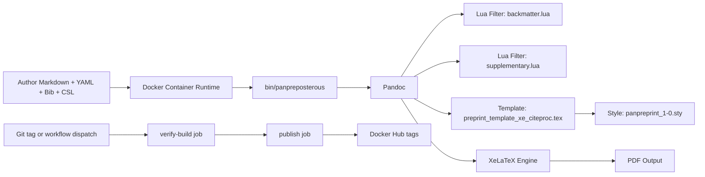

# Panpreposterous Architecture

## Purpose

This document defines the stable subsystem boundaries and execution flow for
Panpreposterous.

Use this file as the technical map for runtime behavior and release-gate
expectations.

## System Overview

## Layered Model

- Runtime and packaging layer:
  [Dockerfile](../Dockerfile) defines OS packages, Pandoc, TinyTeX, and runtime
  filesystem layout.
- Orchestration layer:
  [bin/panpreposterous](../bin/panpreposterous) normalizes output handling,
  validates required inputs/assets, and invokes Pandoc with fixed defaults.
- Transformation layer:
  [filters/backmatter.lua](../filters/backmatter.lua) and
  [filters/supplementary.lua](../filters/supplementary.lua) implement document
  structure policies.
- Presentation layer:
  [template/preprint_template_xe_citeproc.tex](../template/preprint_template_xe_citeproc.tex)
  and [template/panpreprint_1-0.sty](../template/panpreprint_1-0.sty) define PDF
  formatting behavior.
- Release automation layer:
  [.github/workflows/publish-image.yml](../.github/workflows/publish-image.yml)
  enforces pre-publish verification.
- Release governance layer:
  [docs/release/container-image-lineage.md](release/container-image-lineage.md)
  and
  [docs/release/legacy-image-baseline.json](release/legacy-image-baseline.json)
  encode policy and phase state.

## Subsystem Boundaries

| Subsystem | Owned by | Responsibilities | Does not own |
| --- | --- | --- | --- |
| Runtime image | [Dockerfile](../Dockerfile) | Toolchain install, TinyTeX provenance verification, runtime path layout | Manuscript content semantics |
| CLI wrapper | [bin/panpreposterous](../bin/panpreposterous) | Fail-fast input/runtime checks, fixed Pandoc defaults, argument pass-through | TeX formatting rules |
| Filters | [filters/backmatter.lua](../filters/backmatter.lua), [filters/supplementary.lua](../filters/supplementary.lua) | Backmatter handling, supplementary placement, table behavior contracts | Container install or release publishing |
| Template and style | [template/preprint_template_xe_citeproc.tex](../template/preprint_template_xe_citeproc.tex), [template/panpreprint_1-0.sty](../template/panpreprint_1-0.sty) | Layout, typography, DOI/running-header rendering | Input validation and CI orchestration |
| Release workflow | [.github/workflows/publish-image.yml](../.github/workflows/publish-image.yml) | verify-build gate, publish orchestration, tag rules | Manuscript authoring guidance |

## Execution Flows

### Render Path

1. Build or pull a Panpreposterous container image.
2. Mount a manuscript workspace to `/work`.
3. Invoke `panpreposterous` with manuscript, bibliography, and CSL arguments.
4. Wrapper performs startup assertions and then calls Pandoc.
5. Pandoc + XeLaTeX + filters + template produce a PDF.

### Release Path

1. Trigger `.github/workflows/publish-image.yml` by `v*` tag or workflow
   dispatch.
2. `verify-build` builds the image.
3. `verify-build` runs wrapper help and bundled example smoke render.
4. `publish` runs only after verify succeeds.
5. Buildx pushes the selected tags to Docker Hub.

## Critical Runtime Contracts

### Contract 1: In-Container Runtime Paths

The wrapper assumes the following files exist and are readable in the container:

- `/opt/panpreposterous/template/preprint_template_xe_citeproc.tex`
- `/opt/panpreposterous/filters/backmatter.lua`
- `/opt/panpreposterous/filters/supplementary.lua`

If any of these are missing or unreadable, wrapper startup fails before Pandoc
execution.

### Contract 2: Input Manuscript Readability

The first positional input argument is treated as the manuscript source.

- If no input is provided, wrapper startup exits with an actionable error.
- If the input file is unreadable, wrapper startup exits with an actionable
  error.
- Standard input (`-`) remains accepted.

### Contract 3: Pre-Publish Verification Gate

Container publication depends on a successful `verify-build` gate that checks:

- image build success
- `panpreposterous --help` success
- bundled example render success
- non-empty output PDF artifact

This gate is structural by policy and does not require strict PDF hash or byte
size matching.

## Related Documents

- User-facing usage: [README.md](../README.md)
- Release policy and lineage:
  [docs/release/container-image-lineage.md](release/container-image-lineage.md)
- Workspace evidence anchor:
  [docs/anchor/workspace-architecture-anchor.md](anchor/workspace-architecture-anchor.md)
