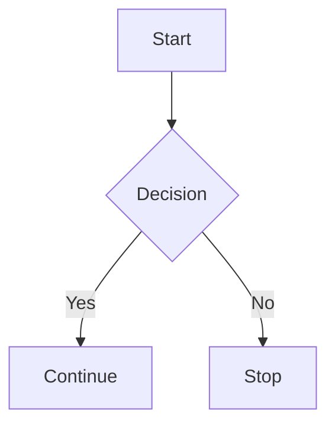

# Diagram Authoring Guide

## Purpose

This guide documents how to include Mermaid diagrams in manuscripts rendered
with Panpreposterous.

## Supported Diagram Input

Use fenced code blocks with the `mermaid` language.

````markdown

````

The Mermaid filter converts each diagram to SVG and then to PDF before LaTeX
inclusion. This keeps output vector quality and improves XeLaTeX reliability.

## Optional Attributes

Set attributes on Mermaid code blocks to control figure rendering.

| Attribute | Meaning | Example |
| --- | --- | --- |
| `caption` | Figure caption text | `caption="Workflow overview."` |
| `label` | LaTeX label for references | `label="fig:workflow"` |
| `width` | LaTeX `\includegraphics` width | `width="0.8\\linewidth"` |
| `max-height` | Maximum figure height | `max-height="0.30\\textheight"` |
| `placement` | LaTeX float placement | `placement="!htbp"` |
| `height` | Mermaid render pixel height | `height="900"` |
| `bg-color` | Mermaid background color | `bg-color="white"` |
| `theme` | Mermaid theme, default `base` | `theme="neutral"` |
| `primary-color` | Node fill color, default white | `primary-color="#f8fafc"` |
| `primary-text-color` | Node text color, default dark gray | `primary-text-color="#111827"` |
| `primary-border-color` | Node border color, default gray | `primary-border-color="#4b5563"` |
| `line-color` | Edge and arrow color, default gray | `line-color="#4b5563"` |

By default, Mermaid diagrams use a manuscript-safe `base` theme with white
flowchart nodes, dark node text, and neutral gray borders and arrows. This keeps
diagram labels readable in PDF output without requiring per-diagram styling.
Flowcharts also use SVG text labels rather than HTML labels because the
SVG-to-PDF conversion step does not reliably preserve Mermaid `foreignObject`
HTML labels.

Example with attributes:

````markdown
```{.mermaid caption="Build pipeline." label="fig:pipeline" placement="!tbp"}
flowchart LR
  Manuscript --> Filter
  Filter --> PDF
```
````

## Two-Column Layout Rules

When `twocolumn: true` is enabled:

- Standard Mermaid blocks render as `figure` floats.
- Mermaid blocks with `.fullwidth`, `.wide`, `.widetable`, or `.starred`
  classes render as `figure*` floats.

Full-width example:

````markdown
```{.mermaid .fullwidth caption="System sequence." label="fig:seq"}
sequenceDiagram
  participant A as Author
  participant B as Build
  A->>B: Render manuscript
  B-->>A: Output PDF
```
````

## Error Handling

If Mermaid rendering fails, the filter emits a framed fallback marker in the
PDF instead of stopping the whole build. Common causes include invalid Mermaid
syntax and missing runtime dependencies.

## Related Documents

- Input contract: [docs/inputs.md](inputs.md)
- Filter behavior reference: [docs/filters.md](filters.md)
- Project overview: [README.md](../README.md)
