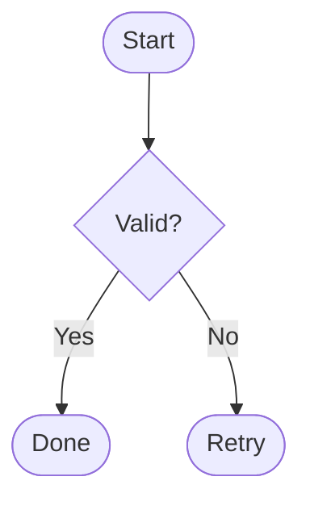

# Manuscript Input Contract

## Purpose

This document defines the metadata and file-level input contract for
Panpreposterous manuscript rendering.

Use this reference to prepare manuscript front matter before running the
container command.

## Required Project Files

Panpreposterous expects these input files in your manuscript workspace:

- `manuscript.md`
- bibliography file passed via `--bibliography` (for example `references.bib`)
- citation style file passed via `--csl` (for example `journal.csl`)

If figures, tables, or included TeX blocks are referenced by the manuscript,
those files must also exist at the paths used in Markdown.

## Minimal Required Metadata

For a stable and complete render, include the following YAML metadata keys.

| Key | Type | Requirement | Notes |
| --- | --- | --- | --- |
| `title` | string | Required | Used in the document title block and running-title fallback. |
| `author` | list of objects | Required | Each entry should define at least `name`; include `affiliation` ids when available. |
| `affiliations` | list of objects | Required | Each entry should provide `id` and `name`; used to map author affiliations. |
| `running_title` | string | Required | Used in running headers. |
| `doc_version` | string | Required | Expected values are `Preprint` or `Postprint`. |
| `twocolumn` | boolean | Required | Controls one-column versus two-column layout behavior. |
| `correspondence` | list of strings | Required | Printed in the first-page footer when provided. |

Minimal validated example:

````markdown
---
title: "Example Manuscript"
author:
  - name: "First Author"
    affiliation: [1]
    corresponding: true
affiliations:
  - id: 1
    name: "Department of Biology"
running_title: "Example"
doc_version: "Preprint"
twocolumn: true
correspondence:
  - first.author@institute.edu (F. Author)
---
````

## Optional Metadata by Behavior Domain

### Layout and Typography

- `mainfont`, `sansfont`, `monofont`
- `date`
- `doc_version_label`

Use these when you need to override defaults for fonts, publication label text,
or displayed date.

Current font regression coverage is intentionally limited to Western European
Latin text, including accented letters used in French, Spanish, Portuguese,
and related languages, together with the common punctuation and symbol cases
documented in the font fixture. Other scripts and writing systems are not yet
part of the supported coverage set.

Runtime-tested font families in the official container image:

- `DejaVu Serif`
- `DejaVu Sans`
- `DejaVu Sans Mono`

Font fallback contract:

- If a requested `mainfont`, `sansfont`, or `monofont` is unavailable at
  runtime, the template emits a warning and applies a safe fallback.
- Fallback defaults are:
  - main font: `TeX Gyre Termes`
  - sans font: `DejaVu Sans`
  - mono font: `DejaVu Sans Mono`
- For reproducible typography across collaborators, prefer font names known to
  exist in the container runtime.

### DOI Side-Margin Rendering

- `preprint_doi`, `preprint_doi_label`
- `published_doi`, `published_doi_label`
- `side_doi_color`
- `side_doi_opacity`
- `side_doi_shift`
- `side_doi_rotation`

Use these to control whether DOI labels appear in page margins and how they are
styled.

### Abstract and Discovery Metadata

- `abstract`
- `keywords`

Use these for a complete title-page information block.

### Author Annotations

- `author[].orcid`
- `author[].notes`
- `author_notes` list with `mark` and `text`

Use these for ORCID display and custom author-note footnote text.

### Reference Spacing and CSL Output

- `csl_entry_spacing_extra`

Use this to adjust spacing between bibliography entries generated by citeproc.

### Build Artifacts

- `keep_intermediate_tex`

Set this boolean to `true` when you want Panpreposterous to emit a TeX sidecar
file alongside the requested PDF output. For example, with
`-o manuscript.pdf`, enabling this key produces `manuscript.tex` in the same
directory. When omitted or set to `false`, no TeX sidecar is produced.

## Non-Metadata Body Requirements

These are structural manuscript requirements outside YAML metadata:

- Include a references placeholder block so bibliography output has a target:

  ````markdown
  # References {-}
  ::: {#refs}
  :::
  ````

- Use `::: backmatter` for acknowledgements, contributions, and related end
  sections.
- Use `::: supplementary` for deferred supplementary content.

## Mermaid Diagram Blocks

Mermaid diagrams are supported through fenced code blocks using the `mermaid`
language identifier.

Basic example:

````markdown

````

Optional attributes can be provided on the code block to control rendering and
LaTeX float behavior:

- `caption`: figure caption text.
- `label`: LaTeX label for cross-references, for example `fig:workflow`.
- `width`: override figure width used by `\includegraphics`.
- `max-height`: cap rendered figure height.
- `placement`: float placement hint, for example `!htbp`.
- `height`: pixel height passed to Mermaid CLI renderer.
- `bg-color`: Mermaid render background, default `transparent`.
- `theme`: Mermaid theme, default `base`.
- `primary-color`: node fill color, default white.
- `primary-text-color`: node text color, default dark gray.
- `primary-border-color`: node border color, default gray.
- `line-color`: edge and arrow color, default gray.

The default Mermaid theme is tuned for manuscript PDFs: flowchart nodes are
white, text is dark, and borders/arrows are neutral gray so labels remain
visible after SVG-to-PDF conversion. Flowchart labels are emitted as SVG text
rather than Mermaid HTML labels, because the SVG-to-PDF conversion step does not
reliably preserve `foreignObject` HTML labels.

In two-column mode (`twocolumn: true`), Mermaid blocks with classes
`.fullwidth`, `.wide`, `.widetable`, or `.starred` are emitted as `figure*`
floats.

## Validation Checklist

Before rendering:

- YAML block is valid and starts at the top of `manuscript.md`
- `title`, `author`, `affiliations`, `running_title`, `doc_version`,
  `twocolumn`, and `correspondence` are present
- bibliography and CSL files passed in CLI arguments exist
- figure/table/include paths in markdown resolve from the mounted workspace
- if `keep_intermediate_tex: true` is set, confirm the `.tex` sidecar is
  generated next to the target PDF

## Related Documents

- Usage and quickstart: [README.md](../README.md)
- Architecture and runtime contracts: [docs/architecture.md](architecture.md)
- Filter behavior contracts: [docs/filters.md](filters.md)
- Diagram authoring guide: [docs/diagrams.md](diagrams.md)
- Workspace status anchor:
  [docs/anchor/workspace-architecture-anchor.md](anchor/workspace-architecture-anchor.md)
