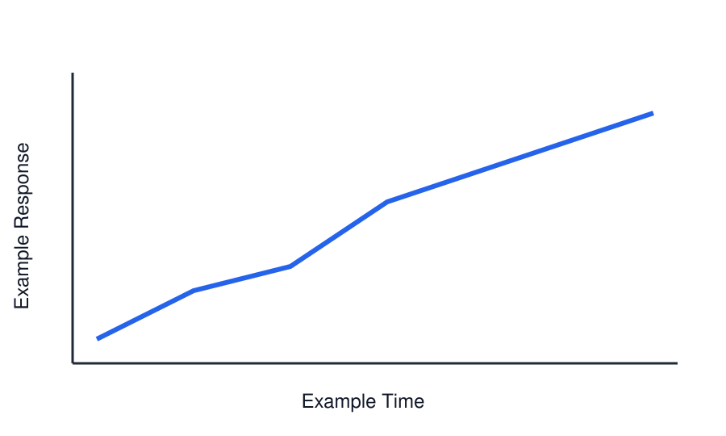
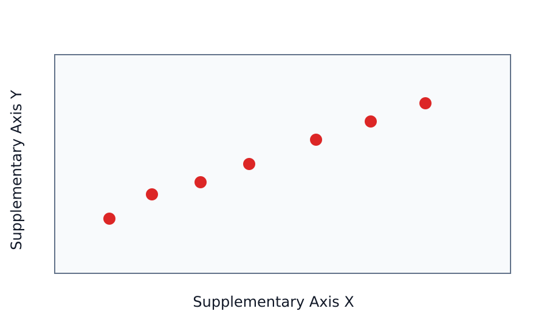

# Introduction

This example includes one citation [@Smith2024].

And an equation:

$$
xi _{ij}(t)= {\frac {\alpha _{i}(t)a^{w_t}_{ij}\beta _{j}(t+1)b^{v_{t+1}}_{j}(y_{t+1})}{\sum _{i=1}^{N} \sum _{j=1}^{N} \alpha _{i}(t)a^{w_t}_{ij}\beta _{j}(t+1)b^{v_{t+1}}_{j}(y_{t+1})}} \tag{Eq. 1}
$$

# Methods

Methods text. This section also includes a \LaTeX table block.

::: {.texinclude src="tables/table1.tex"}
:::

# Results

Results text.

::: {#tbl:fullwidth-example .fullwidth placement="tb"}
| Analysis stage | Markdown-first workflow | Raw-LaTeX fallback |
| --- | --- | --- |
| Authoring | Keep wide prose tables in the manuscript source. | Maintain a separate `table*` environment by hand. |
| Layout | Float the table across both columns near its reference. | Tune placement in raw TeX for each manuscript. |
| Wrapped cells | Use ragged-right fixed-width columns when Pandoc supplies widths. | Add `>{\raggedright\arraybackslash}p{...}` manually. |

Table: **Full-width Markdown table example.** The `.fullwidth` contract renders this table as a two-column `table*` float.
:::

{#fig:main width=0.9\\columnwidth}

# Discussion

Discussion text.

# References {-}

::: {#refs}
:::

::: backmatter

## Acknowledgements {-}

We thank collaborators.

## Author contributions {-}

FA designed and wrote the study.
:::

::: supplementary
**Supplementary note text.**

Sed ut perspiciatis unde omnis iste natus error sit voluptatem accusantium doloremque laudantium, totam rem aperiam, eaque ipsa quae ab illo inventore veritatis et quasi architecto beatae vitae dicta sunt explicabo. Nemo enim ipsam voluptatem quia voluptas sit aspernatur aut odit aut fugit, sed quia consequuntur magni dolores eos qui ratione voluptatem sequi nesciunt. Neque porro quisquam est, qui dolorem ipsum quia dolor sit amet, consectetur, adipisci velit, sed quia non numquam eius modi tempora incidunt ut labore et dolore magnam aliquam quaerat voluptatem. Ut enim ad minima veniam, quis nostrum exercitationem ullam corporis suscipit laboriosam, nisi ut aliquid ex ea commodi consequatur? Quis autem vel eum iure reprehenderit qui in ea voluptate velit esse quam nihil molestiae consequatur, vel illum qui dolorem eum fugiat quo voluptas nulla pariatur?

{#fig:s1 width=0.9\\columnwidth}

| Group | n | Mean | SD |
| --- | ---: | ---: | ---: |
| Control | 12 | 1.03 | 0.11 |
| Treatment A | 12 | 1.27 | 0.14 |
| Treatment B | 12 | 1.41 | 0.18 |

Table: **Supplementary table legend.** Example summary statistics for supplementary analysis.
:::
