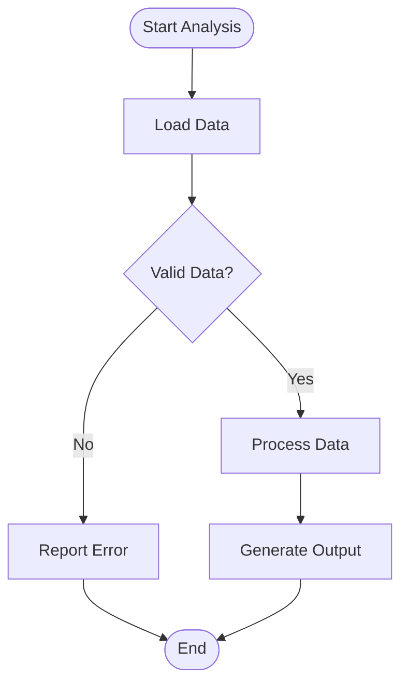
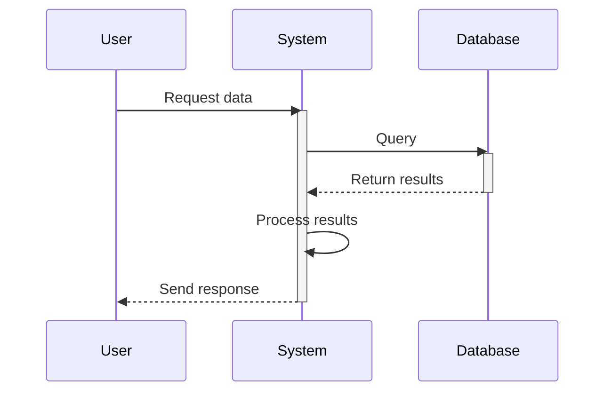
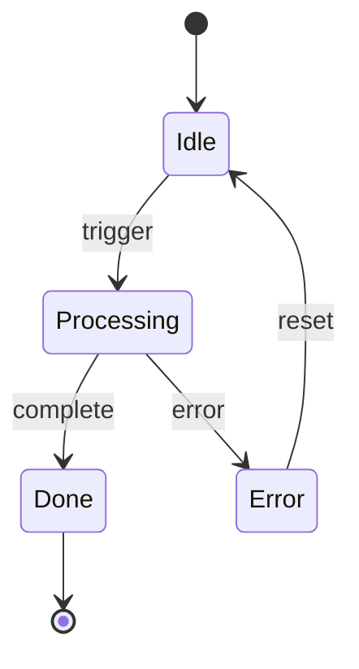

# Introduction

This test document demonstrates the new Mermaid diagram rendering capability in panpreposterous.

# Methods

## Flowchart Example

Here is a simple flowchart showing a decision process:

## Sequence Diagram Example

Here is a sequence diagram showing interaction between components:

## State Diagram Example

Here is a state machine diagram:

# Results

All diagrams should render correctly in the PDF output.

# Discussion

The Mermaid diagram rendering feature allows authors to:
- Include diagrams directly in Markdown
- Maintain version control of diagram definitions
- Keep technical documentation and diagrams together
- Avoid external image file management

# References {-}

::: {#refs}
:::
