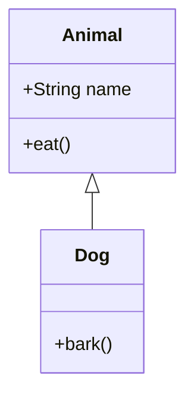
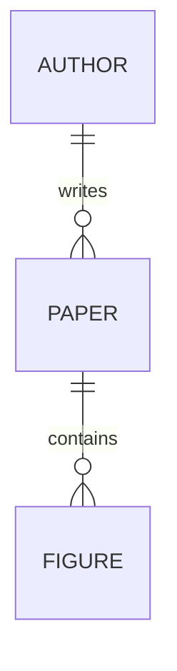
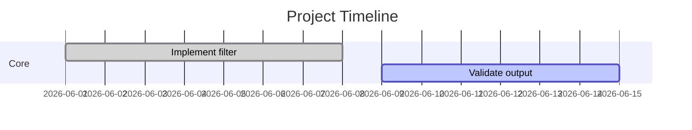
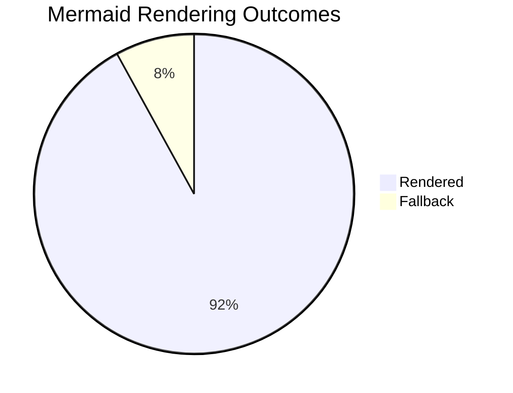

# Mermaid Type Coverage Fixture

Phase 5 Mermaid type-coverage fixture.









```{.mermaid .fullwidth caption="Wide sequence diagram for two-column figure-star policy." label="fig:phase5-wide"}
sequenceDiagram
  participant Author
  participant Build
  participant PDF
  Author->>Build: Trigger render
  Build->>PDF: Include figure assets
  PDF-->>Author: Two-column output
```
